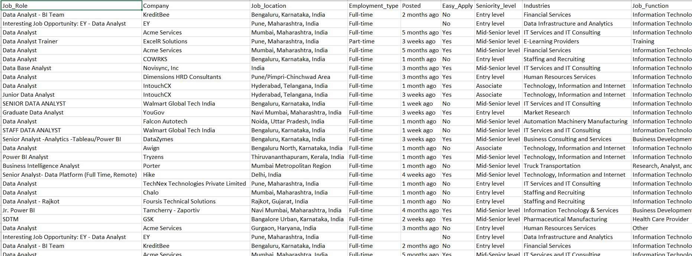

# LinkedIn-jobs-scrapper


## Overview
The LinkedIn Job Scraper is a powerful webscrapping program designed to scrape real-time job postings from the `LinkedIn` platform.
It processes and cleans the scraped data, exporting it to a CSV file, enabling users to conveniently view and apply for jobs in Excel based on their interests. 
It provides a lot of data such as which company, what job-role, when posted, and so on. It will really be helpful to the students of all different domain to find the jobs according to their own domain. <br>
By automating the process of job data extraction, this scraper allows users to quickly gather and organize job postings based on specific criteria such as job type and location. The scraper uses BeautifulSoup for parsing HTML and LXML content, and pandas for data manipulation. 
The output is a clean CSV file, which can be easily opened in Excel for further analysis and job application tracking. This tool simplifies the job search process, saving users valuable time and effort. 
This tool is ideal for job seekers looking to automate and optimize their job search process on LinkedIn, providing a structured and efficient way to gather job information.

## Table of Contents
- [Overview](#overview)
- [Features](#features)
- [Prerequisites](#prerequisites)
- [Technical Details](#technical-details)
- [Installation](#installation)
    -  Clone the Repository
    -  Create a Virtual Environment (Optional)
    -  Install Dependencies
- [Example Usage](#example-usage)
- [Output](#output)
    - CSV File Structure
    - Example Output
    - Data Utilization
    - Benefits
- [Contributors](#contributors)
- [Contributing](#contributing)
- [License](#license)
- [Contact](#contact)

## Features
- **Real-time Job Scraping:** Fetches up-to-date job postings from LinkedIn.
- **Data Cleaning:** Ensures the scraped data is well-organized and free from duplicates.
- **CSV Export:** Exports the cleaned data into a CSV file for easy use in Excel.
- **Customizable Inputs:** Allows users to specify the region/country and job type.

For Example : If you are a CSE major and have interest in Python search `Python Devloper` in `India`. Or if you have interest in Data try searching `Data Analyst` in `United States`. Or if you want to be in Markeing try searching `Digital Marketing` in `China`.  

## Prerequisites
- Python 3.7 and above
- Stable internet connection
- Excel (Any other spreadsheet software that supports csv file)
- LinkedIn account (optional)
- Git (for installation)

## Technical Details:
- **Language:** Python
- **Libraries:** BeautifulSoup or bs4, pandas, os, csv, requests, json
- **Output:** CSV file with detailed jobs information based on the input parameters
- **Input Parameters:** Region/country, job-type

## Installation
Before you begin, ensure you have the following prerequisites already installed on your system.

### 1. Clone the Repository
First, clone the repository to your local machine using Git. Open open your terminal and run the following command:
``` bash
git clone https://github.com/LinconDash/LinkedIn-jobs-scrapper.git
cd LinkedIn-jobs-scrapper
```

### 2. Create a Virtual Environment (Optional)
It's a good practice to use a virtual environment to manage your project dependencies because the packages and site-packages donot get installed on your local enviroment thereby reducing both storage and dependencies issues. Run the following commands to create and activate a virtual environment:
- In Windows
``` bash
python -m venv venv
venv\Scripts\activate
```
- In Mac
``` bash
python -m venv venv
source venv/bin/activate
```

### 3. Install Dependencies
Install the required Python packages listed according to their versions in the `requirements.txt` file using pip:
``` bash
pip install -r requirements.txt
```

## Example Usage
- **Configuration:** Modify the `configfiles.json` file to set your LinkedIn credentials and other parameter like "target-rows" which can be used to fetch the no. of rows of data you want. 
- **Open main.py:** Open up the `main.py` and see the main section just like the image below:
  - 
  - Example : Searching `Python Developer` Jobs in `India`
  - Please feel free to try different kinds jobs you have interest in and also the location according to your choice.
- **Run main.py:** Run the file `main.py` by using the terminal:
``` bash
python main.py
# or python3 main.py
```

## Output
The output of the LinkedIn Jobs Scraper is a CSV file that consolidates all the job data extracted from LinkedIn. This file is generated, cleaned and stored in the `Data` directory of the project.
While fetching the data your output should look something like this image below.


**Note** : The output of the whole process stored in a csv file in the following format `jobs-scraped-on-(searched-date).csv` in the `Data` directory automatically. It is not a problem if you donot have already the `Data` directory as there is a Python script to create one. All the csv files are stored in that directory

### CSV File Structure
The CSV file contains the following columns, providing a comprehensive view of each job listing:

- **Job Role:** The title of the job position.
- **Company:** The name of the company offering the job.
- **Job Location:** The location where the job is based.
- **Employment Type:** Whether the job is full-time, part-time, contract, etc.
- **Posted:** The time when the job was posted (e.g., 1 week ago, 2 months ago).
- **Easy Apply:** Indicates if the job can be applied to easily via LinkedIn.
- **Seniority Level:** The experience level required for the job (e.g., Entry level, Mid-Senior level).
- **Industries:** The industry sector of the company.
- **Job Function:** The primary function or responsibilities of the job.

### Example Output
Here is an example of what the output CSV might look like:
#### Data Analyst Jobs in India


#### Python Developer Jobs in India


#### Software Engineer Jobs in United States


### Data Utilization
The CSV file can be opened and analyzed using spreadsheet software like Microsoft Excel, Google Sheets, or any data analysis tool that supports CSV format. Users can sort, filter, and search through the job listings to find opportunities that best match their skills and preferences.

### Benefits
- Centralized Data: All job listings are consolidated in one file, making it easy to manage and review.
- Customizable: Users can easily adjust filters and sorting options in their spreadsheet software to focus on the most relevant job opportunities.
- Time-Saving: Automates the tedious process of manually searching for jobs, allowing users to concentrate on preparing applications and interviews.

This structured output format ensures that users have a clear and organized view of job opportunities, enhancing the efficiency and effectiveness of their job search process.
Also users who are interested in making some projects related to jobs can use to get the realtime dataset

## Contributors
- Lincon Dash - [Github](https://github.com/LinconDash)

## Contributing
Contributions are welcome! Please adhere to the following guidelines when contributing to this project:

1. Fork the Repository:
- Click on the "Fork" button at the top right corner of the repository page.

2. Clone Your Forked Repository:
``` bash
git clone https://github.com/LinconDash/LinkedIn-jobs-scrapper.git
cd LinkedIn-jobs-scrapper
```

3. Create a New Branch:
- Use a descriptive name for your branch (e.g., new-feature-add, bugfix-fix-scrapping, etc.).
``` bash
git checkout -b your-branch-name
```

4. Make Your Changes:
- Ensure your code follows the project’s coding standards.
- Test your changes thoroughly.

5. Commit Your Changes:
- Write clear and concise commit messages.
``` sh
git commit -m "Description of the changes made"
```

6. Push to Your Forked Repository:
``` sh
git push -u origin your-branch-name
```

7. Create a Pull Request:
- Go to the original repository on GitHub.
- Click on "Pull Requests" and then "New Pull Request."
- Select your branch from the "compare" dropdown and the master branch from the "base" dropdown.
- Provide a clear description of your changes and submit the pull request.

8. Code Review:
- Be open to feedback and make necessary changes if requested by the project maintainer i.e me :)

## License
This project is licensed under the GNU GENERAL PUBLIC license. See the [LICENSE](#https://github.com/LinconDash/LinkedIn-jobs-scrapper?tab=GPL-3.0-1-ov-file) file for details.

## Contact
you have any questions or need further assistance, feel free to contact me at:
- **Email:** lincondash02@gmail.com
- **GitHub:** [LinconDash](https://github.com/LinconDash)
- **LinkedIn:** <a href="https://www.linkedin.com/in/lincon-dash/">Lincon Dash</a>
